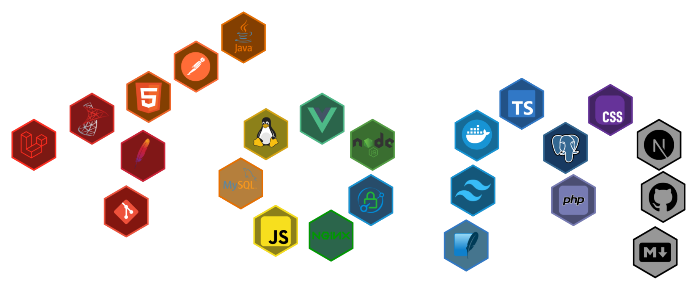
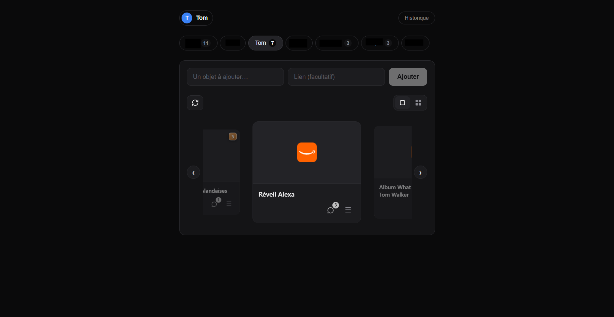

<h1 align="center">Tom.</h1>

  <code>// développeur full-stack — Angers, FR</code>

  Je construis des applis web solides avec <b>Laravel</b> &amp; <b>Vue.js</b> 
  et j'optimise ce qu'il y a sous le capot : les <b>bases de données</b>.

  
  
  
  

  

 

 

## `01` · En chiffres

  
  

  

 

## `02` · En ce moment

<table>
  <tr>
    <td width="42%" valign="top">
      
    </td>
    <td width="58%" valign="top">
      <h3>Wishlist familiale</h3>
      

        Application développée en JavaScript et CSS natifs permettant à chaque membre d’une famille d’ajouter des idées de cadeaux à offrir.
      

      
    </td>
  </tr>
</table>

## `03` · Me contacter

  
  

  <code>build manifest v1 — ~/tom █</code>

